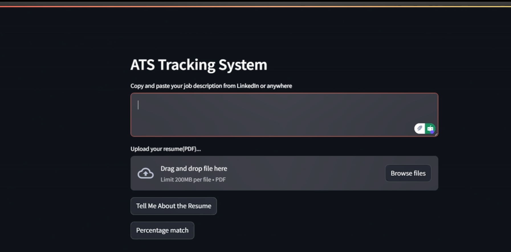
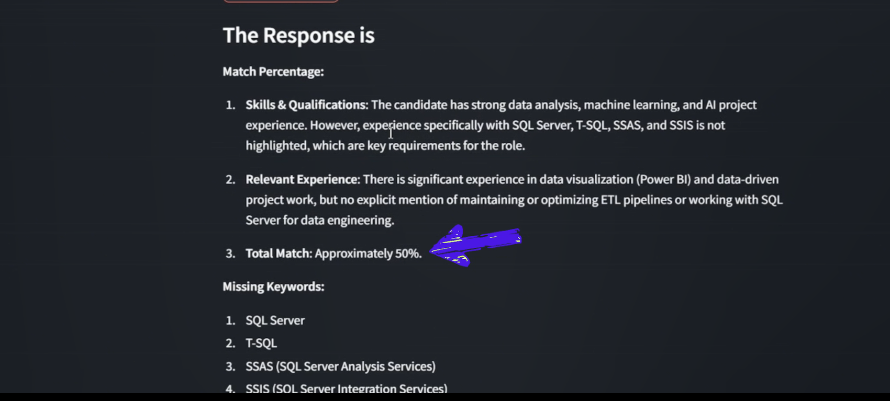

# ATS-Tracking-System

  

Response 
  

Developed an 𝗔𝗽𝗽𝗹𝗶𝗰𝗮𝗻𝘁 𝗧𝗿𝗮𝗰𝗸𝗶𝗻𝗴 𝗦𝘆𝘀𝘁𝗲𝗺 (𝗔𝗧𝗦) Resume Analysis Application that utilizes cutting-edge AI technology to evaluate resumes against job descriptions. This project integrates OpenAI GPT-4o for detailed resume analysis, providing insights into strengths, gaps, alignment, and match percentage with the job role. 

✨ 𝗞𝗲𝘆 𝗙𝗲𝗮𝘁𝘂𝗿𝗲𝘀: 
📄 Upload PDF resumes for analysis 
🤖 AI-driven assessment by an experienced HR model 
📊 Match percentage and missing keywords identification 
📝 Actionable insights for resume improvement 
